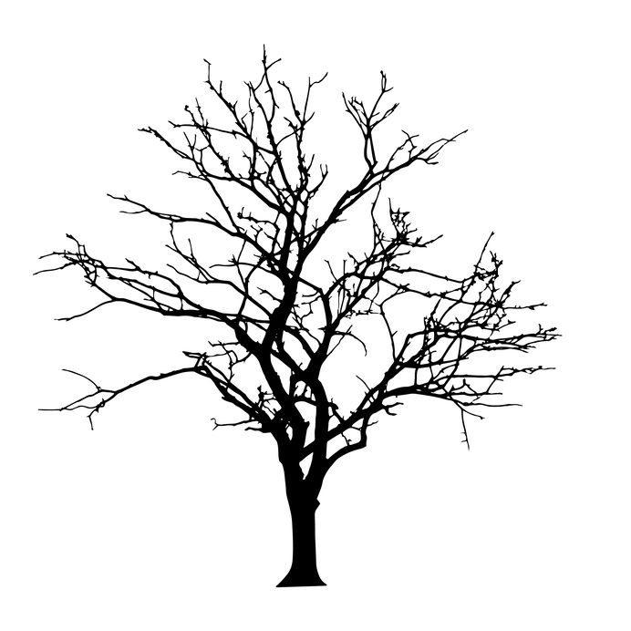

<!-- README.md is generated from README.Rmd. Please edit that file -->

<!-- badges: start -->


```{r setup, include = FALSE}

knitr::opts_chunk$set(

  collapse = TRUE,

  comment = "#>",

  fig.path = "man/figures/README-",

  out.width = "100%"

)

```


```{r, warning=FALSE, include = FALSE}
#Automatically write R package citation entries to a .bib file
knitr::write_bib(c(.packages(), 
                   'bayesplot', 
                   'chillR',
                   'decisionSupport',
                   'dplyr',
                   'ethnobotanyR',
                   'ggplot2', 
                   'ggridges', 
                   'graphics',
                   'plyr', 
                   'reshape', 
                   'tidyverse',
                   'kableExtra',
                   'MASS'), 'packages.bib')
```


# dormancyR

`dormancyR` aims to provide alternatives to common chill models used in horticulture to compute chill metrics in deciduous fruit tree orchards. The package produces outputs compatible with the `chillR` package [@R-chillR]. It also contains functions to handle historic and updated weather data downloaded from Chilean databases (<https://www.cr2.cl>, <https://www.agromet.cl/datos-historicos>). Finally, `dormancyR` also contains a function to obtain weather data from the German Climate Data Center (<https://cdc.dwd.de/portal/>).

`dormancyR` was developed for a scientific manuscript

# References
