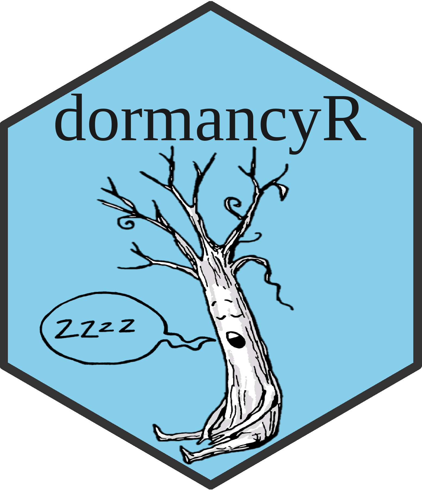

# dormancyR <a></a>

<!-- badges: start -->

[](https://CRAN.R-project.org/package=dormancyR)


[](https://github.com/EduardoFernandezC/dormancyR/actions?workflow=R-CMD-check)
<!-- badges: end -->

<!-- README.md is generated from README.Rmd. Please edit that file -->

# Description

`dormancyR` aims to provide alternatives to common chill models used in
horticulture to compute chill metrics in deciduous fruit tree orchards
as well as functions to handle weather data. The package produces
outputs compatible with the `chillR` package (Luedeling 2020). It also
contains functions to download and handle historic ([Center for Climate
and Resilience Research](https://www.cr2.cl)) and up-to-date
([Agrometeorologia - INIA](https://agrometeorologia.cl/)) weather data
from Chilean databases. Similarly, `dormancyR` contains a function to
download and handle weather data from a German database ([Climate Data
Center](https://cdc.dwd.de/portal/)).

`dormancyR` was developed for a scientific manuscript published in the
European Journal of Agronomy: [The importance of chill model selection -
a multi-site analysis](https://doi.org/10.1016/j.eja.2020.126103)

Since the package is not yet on CRAN, the developer version of
`dormancyR` can be directly installed from github using functions in the
`devtools` library

``` r
devtools::install_github("https://github.com/EduardoFernandezC/dormancyR")
library(dormancyR)
```

# References

<div id="refs" class="references hanging-indent">

<div id="ref-R-chillR">

Luedeling, Eike. 2020. *ChillR: Statistical Methods for Phenology
Analysis in Temperate Fruit Trees*.
<https://CRAN.R-project.org/package=chillR>.

</div>

</div>
