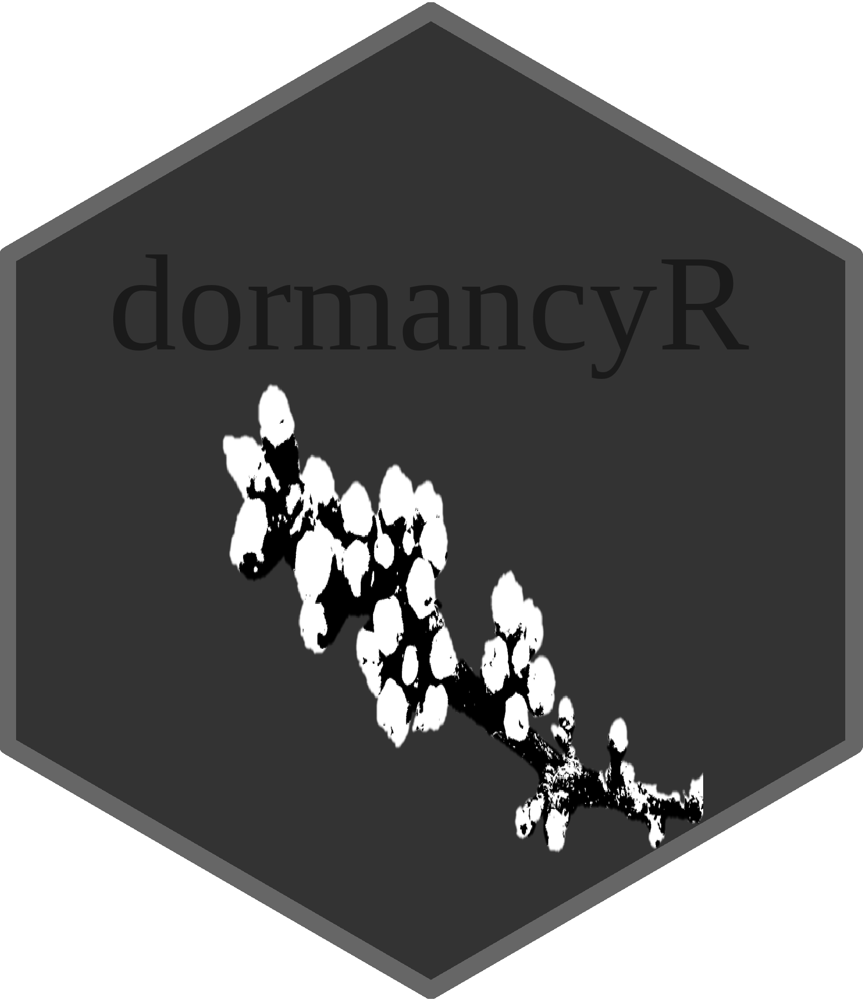

<style>
img {
display: block;
margin: 1!important;
padding: 0!important;
border: 0!important}
</style>




<style>
body {
text-align: justify}
</style>

```{r, include = F}
knitr::opts_chunk$set(
  collapse = TRUE,
  comment = "#>"
)
```

```{r, warning = F, include = F}
#Automatically write R package citation entries to a .bib file
knitr::write_bib(c(.packages(), 
                   'chillR',
                   'dplyr',
                   'ggplot2', 
                   'kableExtra',
                   'dormancyR'), 'packages.bib')
require(tidyverse)
require(kableExtra)
```

## Introduction

Winter chill directly affects tree dormancy and therefore the cultivation of deciduous fruit and nut trees. To quantify chill, researchers have developed a number of mathematical models that only use temperatures as input. These models are normally used in orchard planing and management. For example, a common practice in orchard planing is to compare the historic availability of winter chill in a place with the Chill Requirement of the species and cultivar of interest to overcome winter dormancy. In this vignette, I show an example how to use functions in the `dormancyR` [@R-dormancyR] package to handle historic weather data for Quillota, Chile. Then, I use these data to perform an analysis by using chill models in both the `dormancyR` [@R-dormancyR] and the `chillR` [@R-chillR] package.

## Step-by-step process

First, install the package from the [github repository](<https://github.com/EduardoFernandezC/dormancyR>) and call it by using the function `library`

```{r setup, eval = T}
#devtools::install_github("EduardoFernandezC/dormancyR")
library(dormancyR)
```

For now, `dormancyR` can only handle but not download weather data directly from the chilean databases. Directly downloading is only possible from the [german database](<https://cdc.dwd.de/portal/>) through the function `handle_CDC`. Historic weather data for Chile can be downloaded [here](<http://www.cr2.cl/datos-de-temperaturas-extremas/>) in zip format. For this example, download both the *cr2_tasminDaily_2018_ghcn.zip* and *cr2_tasmaxDaily_2018_ghcn.zip* files and store them into the same folder.

Once downloaded, the user must define the location (directory) in which the zip files have been stored. In this case, I used the folder **New folder** in the **Desktop** to save both files. To get the data in an adequate format use the `chile_weather` function. In this function, the parameter `path_zip_tmin` must include the folder plus the file name (including its extension). The same must be done for the `path_zip_tmax` parameter: 

```{r path_temps, eval = T}
path_zip_tmin <- "C:/Users/Admin/Desktop/New folder/cr2_tasminDaily_2018_ghcn.zip"
path_zip_tmax <- "C:/Users/Admin/Desktop/New folder/cr2_tasmaxDaily_2018_ghcn.zip"
```

`chile_weather` has three modes of use, retrieving 3 different outputs. At this point, it is important to use the first mode which is *info_stations*. This mode allows knowing the closest weather stations to the location of interest defined by the user in `latitude` and `longitude` parameters. The number of weather stations for which the function will give information is defined by `Number_of_stations`. The period of interest is set by `Initial_Date` and `End_Date` parameters as a character string in the form "YYYY-MM-DD".

```{r first_option, eval = T, warning = F}
stations <- chile_weather("info_stations", Initial_Date = "2000-01-01", End_Date = "2017-12-31",
                          latitude = -32.88, longitude = -71.25, Number_of_stations = 10,
                          path_zip_tmin = path_zip_tmin, path_zip_tmax = path_zip_tmax)
```
```{r, warning = F, echo = F}
knitr::kable(stations[-c(1, 3)], "html", row.names = F) %>% kableExtra::kable_styling(bootstrap_options = "condensed")
```

The weather stations listed above are the 10 closest ones to the location of interest. Worth to note that the function retrieves relevant information to check the quality of the data (*N_Obs* and *Perc_days_complete* columns). In the case of the example, if a farmer owns an orchard in **Quillota** he could select and get weather data from the first station of the list.

To get the weather data in `chillR` format, `chile_weather` has to be set to the mode *my_data*.

```{r data, eval = T, warning = F}
data <- chile_weather("my_data", Initial_Date = "2000-01-01", End_Date = "2017-12-31",
                      latitude = -32.88, longitude = -71.25, Number_of_stations = 10,
                      path_zip_tmin = path_zip_tmin, path_zip_tmax = path_zip_tmax)
```
```{r, warning = F, echo = F}
knitr::kable(head(data, 10), "html") %>% kableExtra::kable_styling(bootstrap_options = "condensed")
```

The later step returned a dataframe of weather data in the `chillR` format. However, as usual, the dataframe contains several missing data points. `perc_complete` from `dormancyR` computes the total percentage of data complete in each column of any dataframe.

```{r perc_complete, echo = F}
perc_complete <- perc_complete(data)
knitr::kable(perc_complete(data), "html") %>% kableExtra::kable_styling(bootstrap_options = "condensed")
```

In this case, there is `r paste(round(100 - perc_complete[which(perc_complete$variable == "Tmin"), 2], 1), "%", sep = "")` and `r paste(round(100 - perc_complete[which(perc_complete$variable == "Tmax"), 2], 1), "%", sep = "")` of minimum and maximum temperature records missing. Most of the chill models do not allow the use of dataframes containing missing data. In this regard, we can use `patch_daily_temperatures` from `chillR` to fill missing days with data from close weather stations after a bias correction. To do this, the function requires a list of dataframes containing the alternative data. This list can be provided by `chile_weather` in its last mode of use. *station_list_data* mode returns a list of dataframes containing weather data for all the stations listed in the *info_stations* mode, less the first weather station for which the data have been already downloaded in the *my_data* mode.

```{r list_data}
list <- chile_weather("station_list_data", Initial_Date = "2000-01-01", End_Date = "2017-12-31",
                      latitude = -32.88, longitude = -71.25, Number_of_stations = 25,
                      path_zip_tmin = path_zip_tmin, path_zip_tmax = path_zip_tmax)
```

***Note that the `Number_of_stations` parameter was set to 25 to list more dataframes***

`patch_daily_temperatures` returns a list of two elements. The first element is a dataframe containing the patched weather data. The second element is a list of length equal the number of elements in the list used to patch the main dataframe. This list contains information about the mean and sd bias between both the main and alternative weather stations as well as the number of gaps that were filled. `max_mean_bias` and `max_stdev_bias` parameters set the maximum acceptable bias to use the respective weather station. If this parameter is not met, the weather station is passed on.

```{r patch_temps, eval = T}
patched <- chillR::patch_daily_temperatures(data, list, max_mean_bias = 5, max_stdev_bias = 5)
```

In this case, all the gaps were filled after using data from 13 weather stations.

Most chill models used in horticulture require hourly temperature records as input. However, some chill models used in forestry use a daily time-step. Both cases are covered by `chillR` and `dormancyR` packages. `tempResponse_daily_list` in `chillR` computes responses from several hourly models by estimating the hourly temperature through either a idealized daily temperature curve that uses a sine curve for daytime warming and a logarithmic decay function for nighttime cooling or with empirical hourly temperatures recorded at the location. If the idealized curve is used `latitude` must be provided.

```{r}
chill_hour <- chillR::tempResponse_daily_list(patched[[1]], latitude = -32.88, Start_JDay = 121,
                                              End_JDay = 243,
                                              models = list(CH = chillR::Chilling_Hours,
                                                            UM = chillR::Utah_Model,
                                                            CP = chillR::Dynamic_Model,
                                                            MUM = modified_utah_model,
                                                            NC = north_carolina_model,
                                                            PUM = positive_utah_model,
                                                            LCM = low_chill_model), misstolerance = 5)
```
```{r, echo = F}
knitr::kable(chill_hour[[1]][-c(2, 4)], "html") %>% kableExtra::kable_styling(bootstrap_options = "condensed")
```

The output from `tempResponse_daily_list` in `chillR` is a list containing dataframes such as the one shown above. The names of the columns for the chill models are defined in the argument `models`. Please note that **CH**, **UM** and **CP** stand for Chilling Hours, Utah and Dynamic models, all of which are programmed in `chillR`. On the other hand, **MUM**, **NC**, **PUM**, and **LCM** stand for Modified Utah, North Carolina, Positive Utah, and Low Chill models, all of which programmed in `dormancyR`. To use other chill models that use hourly temperature please see the documentation of the `dormancyR` package.

Other option is to use daily chill models such as those developed in forestry. The outputs of these models can be summarized by `tempResponse_daily` in the `dormancyR` package, an extension of `tempResponse` from `chillR`. This function returns a dataframe using as default the rate of chill (**RoC**), chill days (**CD**), exponential chill (**ExC**), triangular chill (Hanninen - **TrCH**), and triangular chill (Legave - **TrCL**) models.

```{r}

chill_day <- tempResponse_daily(patched[[1]], Start_JDay = 121, End_JDay = 243,
                                models = list(RoC = rate_of_chill_Chmielewski,
                                              CD = chill_days,
                                              ExC = exponential_chill_Tmax,
                                              TrCH = triangular_chill_Hanninen,
                                              TrCL = triangular_chill_Legave))
```
```{r, echo = F}
knitr::kable(chill_day[-c(2, 4)], "html") %>% kableExtra::kable_styling(bootstrap_options = "condensed")
```

After this analysis, and perhaps using more years of data, a farmer or farm adviser could plot the distribution of the winter chill accumulation to get an idea of the most likely values in her/his respective site.

```{r plots, echo = F, fig.show = "hold"}
ggplot(chill_hour[[1]], aes(y = CP)) +
  geom_boxplot() +
  labs(x = "", y = "Chill Portions") +
  theme_light() +
  theme(axis.text.x = element_blank(),
        axis.ticks.x = element_blank())

ggplot(chill_hour[[1]], aes(CP, ..density..)) +
  geom_density(size = 1) +
  labs(x = "Chill Portions", y = "Density") +
  theme_light()
```

## Conclusions

`dormancyR` provides functions, such as `chile_weather`, to handle weather data and get it in an adequate format to compute relevant horticultural metrics. Most weather databases are not always performed in an user-friendly way and for most people, getting the data in an useful format is not always trivial. Moreover, after getting the data, commonly used programming interfaces do not ease the application of analysis such as those covered in this example. `dormancyR` aims to close the gap between getting the data in useful formats and computing relevant horticultural analysis such as the estimation of winter chill availability. In this regard, `dormancyR` aims to help in the decision-making process.

## References